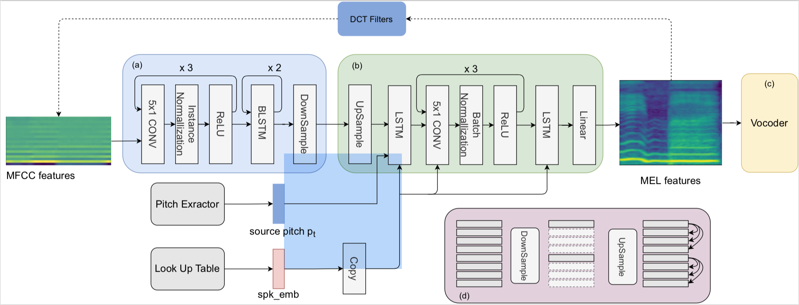

# K-Converter: An unsupervised singing Voice Conversion System

## Abstract

 Singing voice conversion (SVC) converts a singer's voice to another one's voice while preserving the linguistic content. Recently, some SVC systems rely on super-vised phonetic features extracted from pre-trained automatic speech recognition (ASR) models, increasing system complexity. Some end-to-end SVC systems use adver-sarial training, which causes instability during optimization. To address these issues, we present K-Converter, a simple system to disentangle the timbre, pitch, and content information without any manual supervision or adversarial training. First, low quefrencies of mel-frequency cepstral coefficients (MFCC), which remove the global excitation mainly, are used as input representation. And the pitch-shift augmentation is used for further disentangling the pitch. Second, an encoder network is carefully designed to construct an information bottleneck, which learns to break up the pitch and timbre information of the source. Third, the content consistency loss is introduced to keep the content consistent between encoder outputs of source utterances and reconstructed ones. Experimental results show that our proposed system performs well in both speech naturalness and timbre similarity, with better robustness to comparisons. 

 

## Model Architecture
<table border="0">
  <tbody>
    <tr>
      <td></td>
    </tr>
  </tbody>
</table>

 

## Audio Samples

### Target Singers
---
<table>
  <thead>
    <tr>
      <th>Target</th>
      <th>Samples</th>
    </tr>
  </thead>
  <tbody>
    <tr>
      <td>Female</td>
      <td><audio controls="" preload="auto">
            <source src="target_waves/f_biaobei_002_01.wav"></audio></td>
    </tr>
    <tr>
      <td>M1</td>
      <td><audio controls="" preload="auto">
            <source src="target_waves/m_biaobei_093_0001.wav"></audio></td>
    </tr>
  </tbody>
</table>
----

### Source Singers
---
<table>
  <thead>
    <tr>
      <th>Target</th>
      <th>Samples</th>
    </tr>
  </thead>
  <tbody>
    <tr>
      <td>F1</td>
      <td><audio controls="" preload="auto">
            <source src="target_waves/f_wangchenrui_1021_500_002.wav"></audio></td>
    </tr>
    <tr>
      <td>F2</td>
      <td><audio controls="" preload="auto">
            <source src="target_waves/f_mpol_20_123.wav"></audio></td>
    </tr>
    <tr>
      <td>M1</td>
      <td><audio controls="" preload="auto">
            <source src="target_waves/m_wuduo_1028_766_018.wav"></audio></td>
    </tr>
    <tr>
      <td>M2</td>
      <td><audio controls="" preload="auto">
            <source src="target_waves/m_zhiy_14_123.wav"></audio></td>
    </tr>
  </tbody>
</table>
----

### Comparison with Baseline Systems

#### Target Female

<table align="center">
  <thead>
    <tr>
      <th>System</th>
      <th>F1</th>
      <th>F2</th>
      <th>M1</th>
      <th>M2</th>
    </tr>
  </thead>
  <tbody>
   <tr>
      <td>BASE1</td>
      <td><audio controls="" preload="auto"><source src="vae_kl/vaekl-f_wangchenrui_1021_500_002.npy-to-f_biaobei_gen.wav"></audio></td>
      <td><audio controls="" preload="auto"><source src="vae_kl/vaekl-f_mpol_20_123_to_fbiaobei.wav"></audio></td>
      <td><audio controls="" preload="auto"><source src="vae_kl/vaekl-m_wuduo_1028_766_018.npy-to-f_biaobei_gen.wav"></audio></td>
      <td><audio controls="" preload="auto"><source src="vae_kl/vaekl-m_zhiy_14_123_to_fbiaobei.wav"></audio></td>
    </tr>
    <tr>
      <td>BASE2</td>
      <td><audio controls="" preload="auto"><source src="spk_pitch_confusion/confusion-f_wangchenrui_1021_500_002.npy-to-f_biaobei_gen.wav"></audio></td>
      <td><audio controls="" preload="auto"><source src="spk_pitch_confusion/confusion-f_mpol_20_123_to_fbiaobei.wav"></audio></td>
      <td><audio controls="" preload="auto"><source src="spk_pitch_confusion/confusion-m_wuduo_1028_766_018.npy-to-f_biaobei_gen.wav"></audio></td>
      <td><audio controls="" preload="auto"><source src="spk_pitch_confusion/confusion-m_zhiy_14_123_to_fbiaobei.wav"></audio></td>
    </tr>
    <tr>
      <td>Ours</td>
      <td><audio controls="" preload="auto"><source src="ours/oursox-f_wangchenrui_1021_500_002.npy-to-f_biaobei_gen.wav"></audio></td>
      <td><audio controls="" preload="auto"><source src="ours/oursox-f_mpol_123_to_fbiaobei.wav"></audio></td>
      <td><audio controls="" preload="auto"><source src="ours/oursox-m_wuduo_1028_766_018.npy-to-f_biaobei_gen.wav"></audio></td>
      <td><audio controls="" preload="auto"><source src="ours/oursox-m_zhiy_14_123_to_fbiaobei.wav"></audio></td>
    </tr>
  </tbody>
</table>
----
#### Target Male

<table align="center">
  <thead>
    <tr>
      <th>System</th>
      <th>F1</th>
      <th>F2</th>
      <th>M1</th>
      <th>M2</th>
    </tr>
  </thead>
  <tbody>
   <tr>
      <td>BASE1</td>
      <td><audio controls="" preload="auto"><source src="vae_kl/vaekl-f_wangchenrui_1021_500_002.npy-to-m_biaobei_gen.wav"></audio></td>
      <td><audio controls="" preload="auto"><source src="vae_kl/vaekl-f_mpol_20_123_to_mbiaobei.wav"></audio></td>
      <td><audio controls="" preload="auto"><source src="vae_kl/vaekl-m_wuduo_1028_766_018.npy-to-m_biaobei_gen.wav"></audio></td>
      <td><audio controls="" preload="auto"><source src="vae_kl/vaekl-m_zhiy_14_123_to_mbiaobei.wav"></audio></td>
    </tr>
    <tr>
      <td>BASE2</td>
      <td><audio controls="" preload="auto"><source src="spk_pitch_confusion/confusion-f_wangchenrui_1021_500_002.npy-to-m_biaobei_gen.wav"></audio></td>
      <td><audio controls="" preload="auto"><source src="spk_pitch_confusion/confusion-f_mpol_20_123_to_mbiaobei.wav"></audio></td>
      <td><audio controls="" preload="auto"><source src="spk_pitch_confusion/confusion-m_wuduo_1028_766_018.npy-to-m_biaobei_gen.wav"></audio></td>
      <td><audio controls="" preload="auto"><source src="spk_pitch_confusion/confusion-m_zhiy_14_123_to_mbiaobei.wav"></audio></td>
    </tr>
    <tr>
      <td>Ours</td>
      <td><audio controls="" preload="auto"><source src="ours/oursox-f_wangchenrui_1021_500_002.npy-to-m_biaobei_gen.wav"></audio></td>
      <td><audio controls="" preload="auto"><source src="ours/oursox-f_mpol_20_123_to_mbiaobei.wav"></audio></td>
      <td><audio controls="" preload="auto"><source src="ours/oursox-m_wuduo_1028_766_018.npy-to-m_biaobei_gen.wav"></audio></td>
      <td><audio controls="" preload="auto"><source src="ours/oursox-m_zhiy_14_123_to_mbiaobei.wav"></audio></td>
    </tr>
  </tbody>
</table>
----
### Ablation 

<table align="center">
  <thead>
    <tr>
      <th>Feature Representation</th>
      <th>F2F</th>
      <th>F2M</th>
      <th>M2F</th>
      <th>M2M</th>
    </tr>
  </thead>
  <tbody>
   <tr>
      <td>MEL80</td>
      <td><audio controls="" preload="auto"><source src="mel2mel_ours/mel2mel-oursrc-f_wangchenrui_1021_500_002.npy-to-f_biaobei_gen.wav"></audio></td>
      <td><audio controls="" preload="auto"><source src="mel2mel_ours/mel2mel-oursox-f_wangchenrui_1021_500_002.npy-to-m_biaobei_gen.wav"></audio></td>
      <td><audio controls="" preload="auto"><source src="mel2mel_ours/mel2mel-oursrc-m_wuduo_1028_766_018.npy-to-f_biaobei_gen.wav"></audio></td>
      <td><audio controls="" preload="auto"><source src="mel2mel_ours/mel2mel-oursrc-m_wuduo_1028_766_018.npy-to-m_biaobei_gen.wav"></audio></td>
    </tr>
    <tr>
      <td>MFCC20</td>
      <td><audio controls="" preload="auto"><source src="mfcc2mel_noaug_ours/srcdata-oursox-f_wangchenrui_1021_500_002.npy-to-f_biaobei_gen.wav"></audio></td>
      <td><audio controls="" preload="auto"><source src="mfcc2mel_noaug_ours/srcdata-oursox-f_wangchenrui_1021_500_002.npy-to-m_biaobei_gen.wav"></audio></td>
      <td><audio controls="" preload="auto"><source src="mfcc2mel_noaug_ours/srcdata-oursox-m_wuduo_1028_766_018.npy-to-f_biaobei_gen.wav"></audio></td>
      <td><audio controls="" preload="auto"><source src="mfcc2mel_noaug_ours/srcdata-oursox-m_wuduo_1028_766_018.npy-to-m_biaobei_gen.wav"></audio></td>
    </tr>
    <tr>
      <td>+Aug</td>
      <td><audio controls="" preload="auto"><source src="ours/oursox-f_wangchenrui_1021_500_002.npy-to-f_biaobei_gen.wav"></audio></td>
      <td><audio controls="" preload="auto"><source src="ours/oursox-f_wangchenrui_1021_500_002.npy-to-f_biaobei_gen.wav"></audio></td>
      <td><audio controls="" preload="auto"><source src="ours/oursox-m_wuduo_1028_766_018.npy-to-f_biaobei_gen.wav"></audio></td>
      <td><audio controls="" preload="auto"><source src="ours/oursox-m_wuduo_1028_766_018.npy-to-m_biaobei_gen.wav"></audio></td>
    </tr>
  </tbody>
</table>

<table align="center">
  <thead>
    <tr>
      <th>temporal down-sampling rate</th>
      <th>F2F</th>
      <th>F2M</th>
      <th>M2F</th>
      <th>M2M</th>
    </tr>
  </thead>
  <tbody>
   <tr>
      <td>1</td>
      <td><audio controls="" preload="auto"><source src="mel2mel_ours/mel2mel-oursrc-f_wangchenrui_1021_500_002.npy-to-f_biaobei_gen.wav"></audio></td>
      <td><audio controls="" preload="auto"><source src="mel2mel_ours/mel2mel-oursox-f_wangchenrui_1021_500_002.npy-to-m_biaobei_gen.wav"></audio></td>
      <td><audio controls="" preload="auto"><source src="mel2mel_ours/mel2mel-oursrc-m_wuduo_1028_766_018.npy-to-f_biaobei_gen.wav"></audio></td>
      <td><audio controls="" preload="auto"><source src="mel2mel_ours/mel2mel-oursrc-m_wuduo_1028_766_018.npy-to-m_biaobei_gen.wav"></audio></td>
    </tr>
    <tr>
      <td>8</td>
      <td><audio controls="" preload="auto"><source src="mel2mel_ours/mel2mel-oursrc-f_wangchenrui_1021_500_002.npy-to-f_biaobei_gen.wav"></audio></td>
      <td><audio controls="" preload="auto"><source src="mel2mel_ours/mel2mel-oursox-f_wangchenrui_1021_500_002.npy-to-m_biaobei_gen.wav"></audio></td>
      <td><audio controls="" preload="auto"><source src="mel2mel_ours/mel2mel-oursrc-m_wuduo_1028_766_018.npy-to-f_biaobei_gen.wav"></audio></td>
      <td><audio controls="" preload="auto"><source src="mel2mel_ours/mel2mel-oursrc-m_wuduo_1028_766_018.npy-to-m_biaobei_gen.wav"></audio></td>
    </tr>
    <tr>
      <td>32</td>
      <td><audio controls="" preload="auto"><source src="mel2mel_ours/mel2mel-oursrc-f_wangchenrui_1021_500_002.npy-to-f_biaobei_gen.wav"></audio></td>
      <td><audio controls="" preload="auto"><source src="mel2mel_ours/mel2mel-oursox-f_wangchenrui_1021_500_002.npy-to-m_biaobei_gen.wav"></audio></td>
      <td><audio controls="" preload="auto"><source src="mel2mel_ours/mel2mel-oursrc-m_wuduo_1028_766_018.npy-to-f_biaobei_gen.wav"></audio></td>
      <td><audio controls="" preload="auto"><source src="mel2mel_ours/mel2mel-oursrc-m_wuduo_1028_766_018.npy-to-m_biaobei_gen.wav"></audio></td>
    </tr>
  </tbody>
</table>

    
